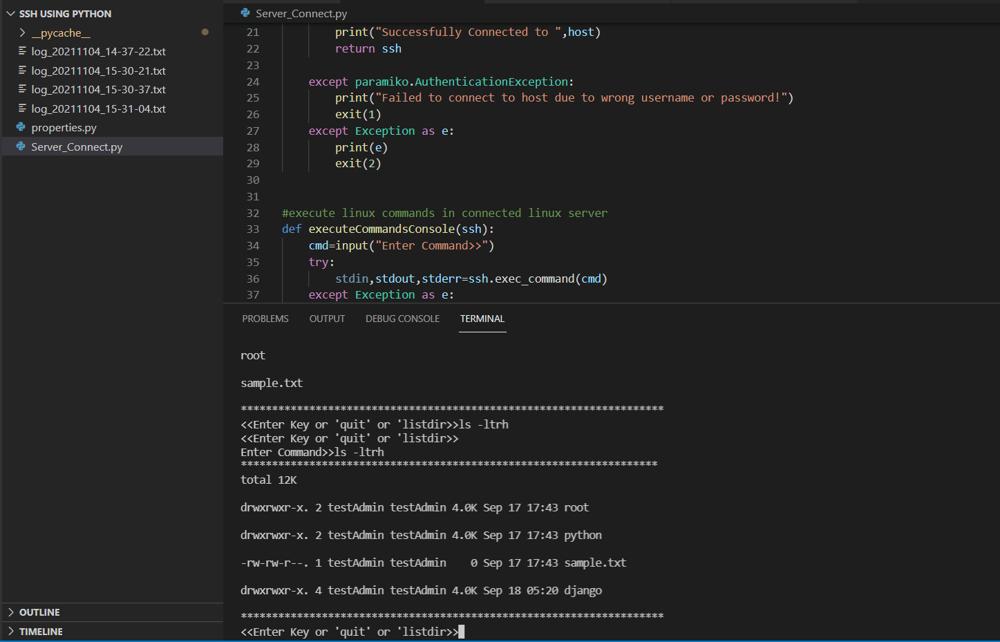

<h2>SSH Using Python</h2> 

Uses the python <b>paramiko library</b> to establish a secure <b>SSHv2 protocol</b> connection to a remote linux server and using functional programming have implemented a logic to pass unix commands to be 
executed in the remote server and view to output & errors in the local window

  

<h3>Features</h3>
<li>Establish connection using hostname,username & password.</li> 
<li>User Friendly Program Menu.</li> 
<li>Can use <b>Save mode</b> to save to outputs of linux commands to a log file.</b> 
<li><b>listdir</b> option to list all directories</li>
<h4>For more info on paramiko library refer this <a href="https://www.paramiko.org/">link</a></h3>

